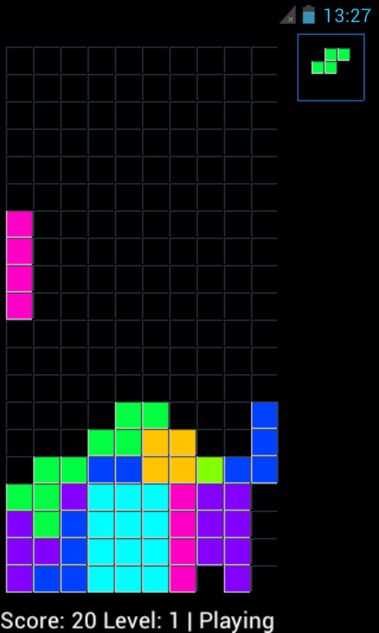

[](https://github.com/bailuk/TLG/actions/workflows/kotlin-on-ubuntu.yml)
[](https://github.com/bailuk/TLG/actions/workflows/node-on-ubuntu.yml)

# About
*TLG - Tetris Like Game* Kotlin and Typescript variant for multiple GUI-platforms.
    
# Screenshot
  

# Dependencies
- Java 11
- GTK 4
- Android SDK
- Node.js and npm

# Build and run
```bash
# Build all Kotlin variants
./gradlew build

# Build GTK 4 variant
./gradlew tlg_gtk:build
./gradlew tlg_gtk:run

# Build Swing variant
./gradlew tlg_swing:build
./gradlew tlg_swing:run

# Build Android variant
./gradlew tlg_android:build

# Browser: install, build and run
cd js/browser
npm install
npm run build
npm run serve

# GTK (node-gtk): install, build and run
cd js/gtk
npm run build
npm run start
```

# Install distribution (Kotlin / GTK-4 variant)
- Install dependencies: `sudo apt install openjdk-11-jre libgtk-4-1`
- Download `tlg-gtk.zip` from [release](https://github.com/bailuk/TLG/releases) or [build pipeline](https://github.com/bailuk/TLG/actions)
- Extract archive: `unzip tlg-gtk.zip`
- Run install script as user: `sh install.sh`

# License
Source code is released under the [MIT License](https://en.wikipedia.org/wiki/MIT_License)
