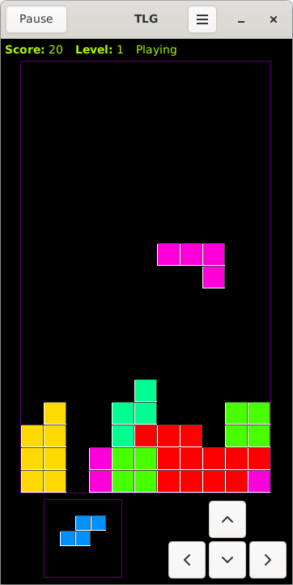

# About
*TLG - Tetris Like Game* is a minimalistic tetris-like Game written in Java. It supports multible GUI-platforms.
    
# Screenshot
  
TLG running on Android.

# Build and run
## All variants:
Open file `settings.gradle.kts` in text editor and comment/uncomment lines to enable specific variants.

## awt / swing / swt:
In terminal execute `./gradlew assemble` to build variant(s) and then execute `./gradlew run` to run variant(s).
Note: when building the swt variant an artifact will be downloaded from the gradle maven repository.

## android:
1. Install adb and android SDK. Or install [Android Studio](https://developer.android.com/studio/).
2. Set `ANDROID_SDK_ROOT` environment variable. For example: `export ANDROID_SDK_ROOT=$HOME/Android/Sdk/`
3. In terminal execute `./gradlew assemble` to download artifacts and build apks.
4. In terminal execute `adb install ./tlg_android/build/outputs/apk/debug/tlg_android-debug.apk` to install apk on connected android device.

# Copyright
(c) 2016-2020 [Lukas Bai](mailto:bailu@bailu.ch)  
[CC BY 4.0](http://creativecommons.org/licenses/by/4.0/)

